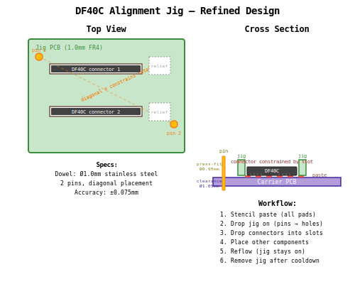

# DF40C Alignment Jig

PCB-based alignment jig for soldering Hirose DF40C-100DS-0.4V connectors, as used on Raspberry Pi CM4/CM5 carrier boards.

## Problem

The DF40C 100-pin connector (0.4mm pitch) is extremely difficult to align during hand or semi-manual assembly. There are no through-hole alignment features — placement relies entirely on skill and magnification.

## Solution

A thin FR4 jig PCB with precision-routed slots that constrain the connector body. Press-fit dowel pins register the jig to the carrier board via tooling holes, providing repeatable ±0.075mm placement accuracy.

## How It Works

1. Stencil solder paste onto the carrier board (all pads)
2. Drop the jig onto the carrier — dowel pins locate into tooling holes
3. Drop DF40C connectors into the routed slots
4. Place all other components
5. Reflow with jig in place
6. Remove jig after cooldown

## Design Principles

- **2 diagonal dowel pins** — constrains position and rotation without over-constraining
- **Press-fit pins in jig** (hole = pin Ø − 0.05mm) — permanent, no soldering
- **Clearance holes on carrier** (hole = pin Ø + 0.05mm NPTH) — jig slides on/off freely
- **Slot width = connector body width** — constrains lateral movement
- **Open short ends** — full visibility of pins and pads
- **Relief cutouts** — clearance for nearby components
- **FR4 jig** — survives reflow temperatures

## Specifications

| Parameter | Value |
|-----------|-------|
| Dowel pin diameter | 1.5mm or 2.0mm stainless steel (testing both) |
| Jig hole (press-fit) | pin diameter − 0.05mm |
| Carrier hole (clearance) | pin diameter + 0.05mm NPTH |
| Jig PCB thickness | 1.0mm |
| Placement accuracy | ±0.075mm |
| Target connector | DF40C-100DS-0.4V (0.4mm pitch) |

### Pin diameter selection

1.0mm was considered but rejected — too fragile and difficult to handle.
Ordered both 1.5mm and 2.0mm pins to evaluate:

- **1.5mm**: smaller holes, less routing disruption on carrier, still rigid enough
- **2.0mm**: very robust, easy to handle, but larger holes may conflict with traces

Final choice depends on available space near DF40C connector pads on the Granit carrier board.

## Status

🚧 **Work in progress** — concept validated, PCB design pending.

## Related

- [Granit project](https://github.com/laenzlinger/granit) — CM4 carrier board where this jig will be used
- [Issue #39](https://github.com/laenzlinger/granit/issues/39) — original discussion

## License

[CERN Open Hardware Licence Version 2 - Permissive](https://ohwr.org/cern_ohl_p_v2.txt)
